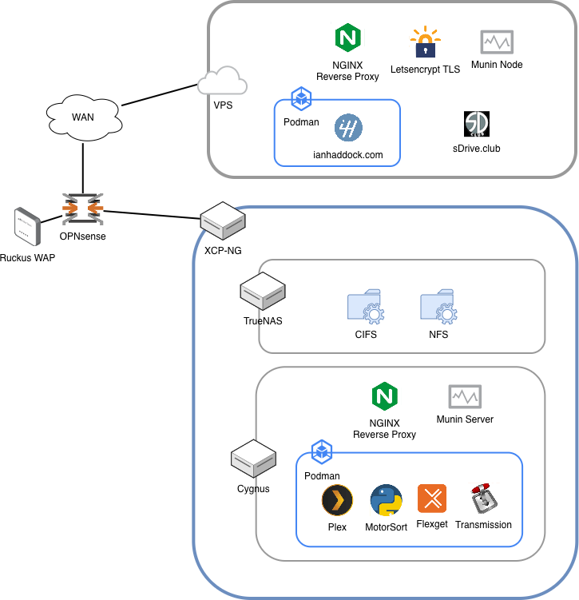

[](https://github.com/ianhaddock/homelab/actions/workflows/ansible-check.yml)

# Homelab
An increasingly vintage yet generally energy efficient array of systems hosting my eclectic mix of entertainment and edu-tainment flavored services and software. Built publicly and with portability in mind, many of these ansible roles can be plucked out and setup in your environment with minimal changes if you so wish. 

<p align="center">
  
</p>

## How it's built
* Vagrant development environments
* Podman container management
* KVM virtual machines
* ZFS block storage
* mostly CentOS Stream
* sometmes Raspbian

### Role Descriptions
* base-nginx: NGINX reverse proxy & letsencrypt TLS certificates
* blog: my Flask app I built for [my blog][1]
* gitea: public and private git repos
* motorsort: my [custom racing video sorting and poster maker][111]
* pihole: DNS with ad-guard
* munin-node: resource monitoring
* munin-server: resource monitor gui
* grafana: pretty data visualizer
* minio: s3 compatible object storage
* plex: personal media streaming service
* flexget: transmission automation
* transmission: bittorrent client
* jenkins: the classic automation server
* jenkins-agent: automation agent
* navidrome: music streaming service
* timecap: Apple timecapsule service for multiple users

### Utilities & Configurations
* common: installs base packages, enables users, base OS configuration
* sshd: ssh config and hardening (certs only, no user pw), figlet & random quote MOTDs
* zram: enables ram compression as swap with a smaller fallback disk swap cache
* ac_backup: my simple rsync file backup
* file_store: my simple https file server
* wakeonwin: bash alias file to wake my PC

### Raspberry Pi specific
* rpi2b_setup: rpi2b configuration tweaks
* piglow: support for PiGlow hardware

## Quick Start
As this is mostly Ansible based I'm assuming you have Python, Ansible and optionally Vagrant installed. If this is a machine you do other work on, I strongly suggest you [setup a Python virtual environment][112] before you do the following. 

Pull the latest version of the repo
`$ git pull https://github.com/ianhaddock/homelab.git`

Edit the Vagrantfile if you want to use a different IP space, or are using a different VM host. 

Copy the reference example `group_vars/all.yml` file into a new host_vars directory and name the file as the target system's IPv4 IP (xxx.xxx.xxx.xxx.yml).

```
$ mkdir host_vars
$ cp group_vars/all.yml host_vars/[target.systems.ip.address].yml
```

Edit the values in the new host_vars/target.systems.ip.address.yml file to fit your Vagrantfile configuration.

As ssh password login is disabled in the sshd setup, generate a ssh key-pair for the ansible account.

`$ ssh-keygen -f ~/.ssh/ansible`

Add the ansible public key to the common role files directory which it will install for you on the first run

```
$ mkdir -p roles/common/files/public_key
$ cp ~/.ssh/ansible.pub roles/common/files/public_keys/
```

Start the vagrant VM. Using `--provision` will run the `initial-setup.yaml` file and get things started.

`$ vagrant up --provision`

Edit a main playbook as you like, select the role(s) you are interested in running and fire away:

`$ ansible-playbook --private-key ~/.ssh/ansible -u ansible -i development your-playbook.yml`
 

## Contributing
I'm always interested in learning and helping the community. If you have questions or know of a better way to do some of the things here feel free to drop a pull request.


[1]: https://ianhaddock.com
[2]: https://developers.redhat.com/articles/faqs-no-cost-red-hat-enterprise-linux
[111]: https://github.com/ianhaddock/motorsort
[112]: https://docs.python.org/3/library/venv.html
