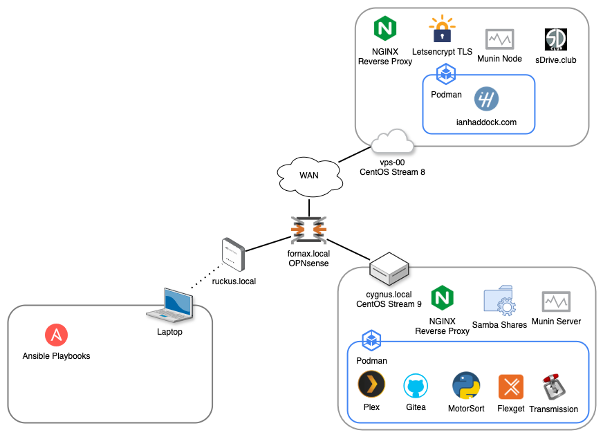

[](https://github.com/ianhaddock/homelab/actions/workflows/ansible-check.yml)

# Homelab
Recently I reduced my homelab environment to the minimums as I refocus on power efficiency, quiet running, and maximized utilization per system. 

<p align="center">
  
</p>

### Roles
* base-nginx: NGINX reverse proxy & letsencrypt TLS certificates
* blog: my Flask app I built for [my blog][1]
* gitea: public and private git repos
* motorsort: my [custom racing video sorting and poster maker][111]
* pihole: DNS with ad-guard
* munin-node: resource monitoring
* munin-server: resource monitor gui
* grafana: pretty data visualizer
* minio: s3 compatible object storage
* plex: personal media streaming service
* flexget: transmission automation
* transmission: bittorrent client
* jenkins: the classic automation server
* jenkins-agent: automation agent
* navidrome: music streaming service
* timecap: Apple timecapsule service for multiple users

### Utility Roles
* common: installs base packages, enables users, base OS configuration
* sshd: ssh config and hardening (certs only, no user pw), figlet & random quote MOTDs
* zram: enables ram compression as swap with a smaller fallback disk swap cache
* ac_backup: my simple rsync file backup
* file_store: my simple https file server
* wakeonwin: bash alias file to wake my PC
* rpi2b_setup: rpi2b configuration tweaks
* piglow: support for PiGlow hardware

## Quick Start
As this Ansible so have Python, Ansible and Vagrant installed.
```
# Pull the latest version of the repo.
$ git pull https://github.com/ianhaddock/homelab.git

# Install the needed Ansible collections.
$ ansible-galaxy install -r roles/requirements.yml

# Edit Vagrantfile for IP and/or VM provider. 
$ vi Vagrantfile 

# Copy the example to new a host_vars directory
$ mkdir host_vars
$ cp group_vars/all.yml host_vars/[target.systems.ip.address].yml

# Edit the new host_vars file to fit your Vagrantfile config
# Generate a ssh key-pair for the ansible account.
$ ssh-keygen -f ~/.ssh/ansible

# Add Ansible public key to the common role files directory
$ mkdir -p roles/common/files/public_key
$ cp ~/.ssh/ansible.pub roles/common/files/public_keys/

# Start vagrant VM using --provision
$ vagrant up --provision

# Edit as you like, select roles and fire away:
$ ansible-playbook --private-key ~/.ssh/ansible -u ansible -i development playbook.yml
```

## Contributing
I'm always interested in learning from and helping the community. If you have questions or know of a better way to do some of the things done here feel free to drop a pull request.

## Donations
If you found this useful and would like to support projects like this you can buy me a coffee:

<p align="center">
<a href="https://www.buymeacoffee.com/ianhaddock" target="_blank"></a>
</p>

[1]: https://ianhaddock.com
[2]: https://developers.redhat.com/articles/faqs-no-cost-red-hat-enterprise-linux
[111]: https://github.com/ianhaddock/motorsort
[112]: https://docs.python.org/3/library/venv.html

