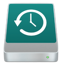

# Multiuser Timecapsule

Apple's networked time machine service using samba and avahi-daemon.

### Firewall
* 445/tcp smb
* 5353/udp mDNS/Avahi
* ipv6_rpfilter=no firewalld

### Samba
* Configuration uses an `include=` in the main smb.conf file to point to the /etc/samba/smb.d/timecap.conf file.
* User directories created at /app_path/app_name/username
* A notification message is shown at the end of the run that a Samba password must be set per user.

### Avahi
* uses the Xserve1,1 model type icon
* has a generated UUID set

### Why disable ipv6 reverse path filtering in firewalld
* Workaround for repeating kernel message 'ipv6 route cache full' ([bug reference][301]) ([serverfault reference][302])

References:
[ovechkin.xyz][303]
[stackoverflow][304]
[selfhosted on reddit][306]
Image from [clipartmax.com][305] 

[301]: https://bugzilla.redhat.com/show_bug.cgi?id=1813691
[302]: https://serverfault.com/questions/902161/linux-host-randomly-stops-answering-ipv6-neighbor-solicitation-requests/907895#907895

[303]: https://ovechkin.xyz/blog/2021-12-13-using-raspberry-pi-for-time-machine
[304]: https://stackoverflow.com/questions/44762488/non-interactive-samba-user-creation-via-ansible

[305]: https://www.clipartmax.com/png/small/265-2655317_time-machine-drive-mac-hard-drive-icon.png
[306]: https://www.reddit.com/r/selfhosted/comments/83vn3p/howto_make_time_machine_backups_on_a_samba
